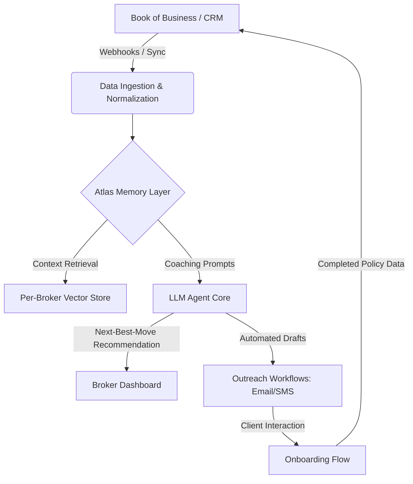

# Hermes

A retention OS for independent insurance brokers.

---

> [!NOTE]
> **Product Showcase & Architecture Repository**
> This repository contains the public documentation, architectural overview, and visual assets for the proprietary **Hermes Broker OS**. The core codebase is closed-source.

---

## What it is

Hermes turns a broker's scattered book of business into an engine that tracks, coaches, and follows up automatically. Built for lean one-person and small-team operations.

**Core features:**
- Client tracking and pipeline visibility
- AI coaching that reads the broker's book and surfaces the next best move
- Automated follow-up and outreach workflows
- Onboarding flows that turn a new client into a set-up policy in minutes
- Atlas — a per-broker memory that learns voice, rhythm, and patterns over time

---

## The model

Most broker software is built for large agencies. Hermes is built for the broker who runs their own book — one person, maybe a small team, doing the work of a much larger operation with the right systems underneath them.

---

## System Architecture

Hermes is built as a stateful, event-driven orchestration system designed to minimize manual broker intervention while maximizing policy retention.

---

Built by [Kyle Miller](https://github.com/kylemillerbuilds) · [Themis Foundry](https://themisfoundry.com)
